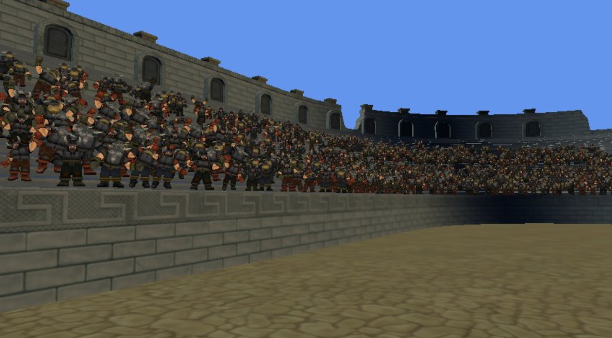

# xna-skinned-model instancing
This article describes how to implement skinned model instancing using the XNA Framework. 



## Motivation
In video games and other forms of interactive media, the animation of 3-D models is paramount. Titles like "Gears of War" and "Half-Life 2" owe much of their immersion to the life-like animations of their characters. Games developed with the XNA framework, which harnesses the powerful Xbox 360 GPU, are no exception. The XNA framework allows for the utilization of many advanced rendering techniques, including skinned model instancing.

Traditional skinned model animation often necessitates significant CPU overhead. Such implementations aren't ideal for instancing. A considerable amount of processing is CPU-based, with each model part (or even each animation frame) demanding its own draw call. When the model has an extensive bone structure, this might lead to multiple draw calls. Within the XNA Framework, rendering numerous animated characters can quickly bottleneck the CPU.

The crux of this article introduces an alternative: skinned model instancing. Using this technique, it's possible to batch animated models, drawing over 45 models — each with distinct animations — in a single draw call. Like any instancing approach, the goal here is to transfer the processing load from the CPU to the GPU. Given the Xbox's robust graphics card, this transition is advantageous.

Inspiration for this write-up was derived from NVIDIA's impressive skinned instancing sample. You can explore their samples [here](http://developer.download.nvidia.com/SDK/10.5/direct3d/samples.html
). Notably, the Dwarf model and arena are adaptations from this sample. A heartfelt thanks to Bryan Dudash and NVIDIA for the sample and granting permission for the assets' usage. Without their foundational paper and sample, this article wouldn't have been feasible. The article's objective is to illustrate how this technique can be applied in DirectX 9 (with optional vfetch) within the XNA Framework.

At its core, traditional skinned animation mandates sending bone matrices for every instance as shader parameters. This restricts the number of instances per draw call (likely just one for intricate models). The workaround is pre-processing the animation data, capturing each animation frame in a texture, and using this texture for GPU transform lookups via vertex texture fetch. An added bonus is bypassing the 59-bone limit, which is constrained by shader parameters. Instead, the only limitation becomes the size of the animation texture.

Before delving deep into skinned model instancing, a succinct overview of skinned animation and instancing is provided. Those unfamiliar with these subjects should refer to the creator's club samples on Skinned Animation and Instancing. The article's introduction might not suffice, so it's advised to review those materials before continuing.

Lastly, the sample code is meticulously annotated. While reading this document provides a high-level grasp of the technique, direct engagement with the code can offer deeper insights.

## A Brief Overview of Skinned Animation...
Skinned animation is a technique that offers realistic mesh deformation. In skinned animation:

Each vertex can be influenced by up to 4 "bones".
Bones are essentially hierarchical transforms.
Animation data is captured as "keyframes", representing the transforms for the bone at specific moments in time.
Each vertex gets weights for the bones influencing it.
For instance, a vertex on a human character's forearm might have a bone weight of 0.5 for the “elbow” and 0.5 for the “wrist”. This allows for a blending effect that realistically deforms between the elbow and wrist bones.

For a practical understanding, the skinned instancing sample on creators.xna.com showcases this from a programming standpoint. The `AnimationPlayer` class computes the transforms for each bone based on the ongoing animation and elapsed time. Invoking `AnimationPlayer.Update()` increments the animation time, setting the latest keyframe as the transform for each bone. However, when drawing the model, these bone transforms are used as shader parameters. While effective, this approach burdens the CPU with matrix multiplication — a potential bottleneck especially with the compact .NET framework on Xbox within the XNA Framework. Also, the usage of all the shader parameters hinders effective instancing.

The pseudo code for skinned model animation is:

```
foreach Vertex v in Model.Vertices
{
    Matrix skinningTransform;
    skinningTransform += Bones[v.BoneIndex0].Transform * v.BoneWeight0;
    skinningTransform += Bones[v.BoneIndex1].Transform * v.BoneWeight1;
    skinningTransform += Bones[v.BoneIndex2].Transform * v.BoneWeight2;
    skinningTransform += Bones[v.BoneIndex3].Transform * v.BoneWeight3;
    v.OutPosition = multiply(skinningTransform, v.Position);
}
```
## A Brief Overview of Instancing...

Instancing is a technique aimed at minimizing the number of Draw calls. Essentially, it enables drawing numerous copies of a model within a single call. As per the XNA performance guidelines, the Xbox GPU is an impressive powerhouse. As such, the goal is to delegate as much processing to it as possible, and instancing offers a route for that.

Every Draw call brings along some CPU overhead. By curtailing the number of these calls, we free up CPU resources for other tasks, such as AI or game logic. As highlighted earlier, instancing's primary aim is to transition processing from the CPU to the GPU. This is crucial for applications that lean heavily on both CPU and GPU. In environments like the XNA Framework, where the compact .NET framework comes into play, CPU performance is highly valued.

Several instancing methods exist:
- __Hardware Instancing__: Per-instance data is transmitted through a distinct vertex stream.
- __Shader Instancing__: This involves sending per-instance data utilizing shader parameters. Both vertex and index buffers are replicated in this approach.
- __vfetch Instancing (Xbox 360)__: Similar to shader instancing, per-instance data is sent via shader parameters. The distinction here is that only the index buffer is duplicated, as the Xbox-specific assembly vfetch instruction fetches against the vertex buffer. While this technique is showcased in the sample, other methods are also viable.

For a more comprehensive understanding, refer to the excellent InstancedModel sample on creators.xna.com. It provides a deeper dive into the subject!

 ## Putting the Two Together

Combining skinned animation with instancing is no simple feat. Both skinned animation and instancing utilize the limited shader parameters available. Skinned animation requires these parameters to define the transforms for each bone, while shader and vfetch instancing rely on them to describe the per-instance transforms.

Even when resorting to hardware instancing (which avoids shader parameters by encoding per-instance data using a distinct vertex stream), one encounters limitations. Given that there are only 59 float4x4 matrix parameters, substantial instancing becomes tricky. For a model with just 15 bones (which isn't an extensive number), managing even 4 instances becomes a hurdle when sharing the 59 float4x4 parameters amongst instances. Elaborate humanoid models can encompass around 80 bones, necessitating multiple draw calls since the current shader models only support 59 float4x4 matrices. This leads us to seek alternative solutions.

By encoding animation data differently – sidestepping the transfer through shader parameters – we free these parameters for instancing. This can be achieved by integrating all animation data into a texture. In the shader, instead of referencing the entire bone matrix array, we only need to reference a single integer denoting the frame. This integer then aids in extracting the bone transforms from the animation texture. The result? We can dispatch numerous models via conventional instancing. The primary alteration being, alongside sending transforms for each instance, we must also send an animation frame. This ensures the shader can retrieve the appropriate transforms.

The structure of the animation texture is outlined as follows:


Incorporating the animation data within a texture presents multiple advantages:

- __Preprocessing__: All animation frames can be preprocessed, eliminating the need for matrix calculations within our animation player.
- __Benefits of Instancing__: We can now fully harness the perks of instancing with skinned models.
- __Bypassing Bone Limitations__: The restriction of 59 bones, due to shader parameters, is now obsolete. Essentially, models can possess any number of bones!
In this sample, the animation texture is crafted by the content pipeline via a bespoke processor. Furthermore, we produce animation data – pinpointing each animation clip's duration, starting frame, concluding frame, and framerate. This streamlined approach facilitates effortless character animation at runtime.

## Performance Characteristics
Understanding the performance attributes and pinpointing bottlenecks are essential in any application, especially in graphics applications. This becomes more intricate due to the parallel operation of a graphics card and a CPU.  Shawn Hargreaves’s blog provides invaluable insights into performance debugging.

### Skinned Model Instancing:

With skinned model instancing, it's imperative to recognize that updating a massive number of characters can tax the CPU heavily. While drawing these models might not strain your system, executing complex logic for each character might. For instance, undertaking intricate vector calculations for 6000 characters every frame could likely underperform, especially on the Xbox using the XNA framework. Thus, for sizable groups, optimizing your update logic is paramount.

In the provided sample, the CPU emerges as a significant bottleneck since the visibility algorithm computes for each dwarf individually. A more efficient approach—and a suggested improvement—would be managing visibility for clusters of objects. Grouped visibility management could enhance performance by minimizing vector operations per frame on the CPU.

Nevertheless, skinned model instancing can still cause render to be a potential chokepoint. The vertex shader might slow things down, particularly due to the fact that vertex texture fetch isn't the swiftest operation. Implementing a Level of Detail (LOD) system, like the NVIDIA example, could drastically reduce the vertex shader load. This is mainly because lower LOD models possess fewer vertices.

To evaluate performance, isolating segments of the pipeline can be helpful. For instance, temporarily removing update logic to see its effect on frame time can offer insights. If there's negligible change, the update logic isn't your bottleneck. On the other hand, retaining update logic while eliminating drawing code can provide different insights.

### Optimizing Performance:

There are numerous strategies to amplify performance. If you're willing to compromise on animation fidelity or work with simple models/animations, further optimization is possible. One such technique is to forgo "skinned" animation for skeletal animation, leveraging just the first bone as a transform. This shift can notably save on vertex texture fetches.

In the given sample, the pixel shader isn't a concern since it lacks intricate lighting or normal mapping effects. However, in other scenarios, it might become an issue. If there's a suspicion that the pixel shader is the bottleneck, replacing intricate logic with a straightforward color return can provide clarity. If frame times remain mostly unchanged, it's evident that the bottleneck lies elsewhere.

## Implementation

The given sample is thoroughly commented, and a deep dive into it can provide a comprehensive explanation. This section presents a high-level overview of its design and the decisions that shaped it.

### Core Components:

#### InstancingSkinnedModelProcessor:

The core processor responsible for converting animation data into a texture and outputting an `InstancedModelContent`.
Operates similarly to the `SkinnedModelProcessor` with additions mirroring the `AnimationPlayer` logic.
Frames are selected at a user-specified frame rate and saved to the texture.

#### InstancedSkinnedModel:

Acts as a runtime class equivalent to a "Model" for `InstancedSkinnedModel`.
Essentially wraps the XNA Framework’s `Model` class.

#### InstanceSkinnedModelPart:

Equates to a “ModelMesh” for an `InstancedSkinnedModel`.

It’s a wrapper for the “ModelMesh” class, enriched with features for instancing and animation data.

### Architectural Insights:

Various structural experiments were conducted. Initially, data (including the animation texture) was stored in the “Tag” property, similar to the `SkinnedModel` processor. This method was discarded because of its heavy runtime dependency on understanding the animation texture.

Subsequently, there was an attempt to derive from the `Model` class. However, due to the sealed nature of the `Model`` class, this path was abandoned.

Inspiration was then drawn from the creators.xna.com InstancedModelSample, leading to the creation of a custom model class. The power of the ModelProcessor was recognized and integrated, leading to an "Adapter" type strategy. By wrapping the Model class with custom features, it harmonized the best functionalities of both approaches.

## Optimization Opportunities:

Although the focus was primarily on skinned model instancing, there's significant scope for improvements:

- The animation texture generated might have unconventional dimensions. It might benefit from restructuring for better hardware compatibility.
- The sample shader currently requires 4 texture reads to decode each matrix. This can be optimized, as demonstrated by the efficient approach in the NVIDIA Skinned model instancing sample.
- Level Of Detail (LOD) is advantageous for large character groups. Leveraging LOD for distant characters can save processing.
- View frustum culling in the sample is inefficient, culling each dwarf instance. Pruning groups can greatly improve efficiency.
- For diverse appearance, skinned model instancing can swap out body parts or textures.
- While shading is kept simple in the sample, the addition of effects like normal mapping can elevate the visual experience.

## Acknowledgements:

Special thanks to NVIDIA and Bryan Dudash for inspiration and for the generous use of their art assets. Additionally, gratitude is extended to the XNA team for creating an exceptional product.

References:
[Skinned Model Instancing. NVIDIA. Bryan Dudash. NVIDIA SDK] (http://developer.download.nvidia.com/SDK/10.5/direct3d/samples.html)
[Skinned Model Sample](http://creators.xna.com/en-us/sample/skinnedmodel)
[Instanced Model Sample](http://creators.xna.com/en-us/sample/meshinstancing)